# Managed Kubernetes Service — Platform Capabilities

**Document status:** Customer-facing capabilities datasheet
**Applies to:** CloudSigma Managed Kubernetes, powered by Kube-DC
**Companion to:** *CloudSigma Platform Capabilities* (sections 1–16)

---

## Introduction

CloudSigma Managed Kubernetes delivers production-grade, CNCF-conformant Kubernetes clusters on the CloudSigma cloud without requiring customers to build, operate or upgrade a control plane. Customers provision a cluster from the CloudSigma marketplace WebApp in minutes, download a `kubeconfig`, and immediately use standard `kubectl`, Helm and any Kubernetes-native tooling against a cluster that behaves exactly like upstream Kubernetes — because it *is* upstream Kubernetes.

The service is built on the same design philosophy as the wider CloudSigma platform: open standards, no proprietary burden, no vendor lock-in. Every cluster runs unmodified upstream Kubernetes with a curated set of open-source add-ons. Workloads, manifests and Helm charts move on and off the platform unchanged. There are no CloudSigma-specific API extensions a customer is obliged to adopt, and no re-architecting is required to run existing Kubernetes workloads.

What CloudSigma operates on the customer's behalf is the *undifferentiated* half of Kubernetes: the control plane (API server, scheduler, controller manager and etcd), its high availability, its backups, its encryption keys, its upgrades and the platform add-ons that make a cluster usable. What the customer keeps is the half that carries their business logic: namespaces, workloads, storage claims, network policy, RBAC and node pool sizing. This boundary is explicit, documented, and enforced technically rather than by convention.

The service covers a range of deployment shapes — from a single-pool development cluster reachable over the public internet, to a multi-pool production cluster with encryption-at-rest, scheduled etcd backups and an API endpoint reachable only from the customer's own private VLAN.

---

## 1. Service Architecture Overview

The managed Kubernetes service is built on a **hosted control plane** model. Each customer cluster's control plane runs as a set of pods inside a CloudSigma-operated management cluster, while the worker nodes run as ordinary KVM virtual machines inside the customer's own CloudSigma account.

This split is the defining architectural decision of the service and it produces most of its operational advantages:

- **No control-plane VMs on the customer's bill.** The customer pays for worker nodes and storage — the resources that actually run their workloads. There are no three master VMs sitting idle to fund.
- **Control-plane high availability is automatic.** The control plane is a Kubernetes Deployment inside a highly available management cluster. Failover is pod rescheduling, measured in seconds, and requires no customer action.
- **Control-plane upgrades are decoupled from worker upgrades.** A control-plane version bump is a rolling Deployment update that does not touch a single customer workload.
- **The blast radius of a worker-node failure is bounded.** Losing a worker node cannot damage the control plane or etcd, because they do not share a failure domain.

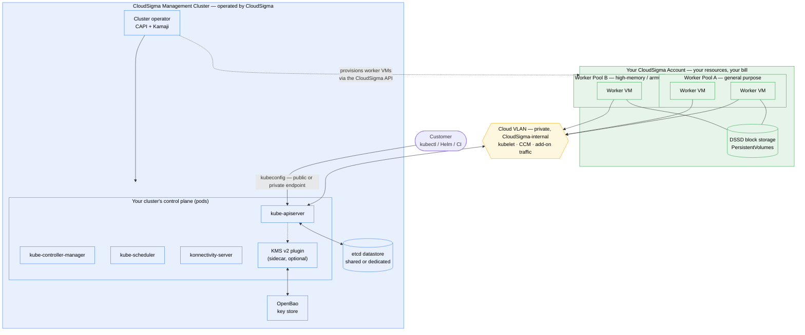

*Managed Kubernetes Service Architecture — control plane operated by CloudSigma, worker nodes in the customer account*

### 1.1. The management layer

The management cluster hosts every customer cluster's control plane. It runs the cluster lifecycle operator, which reconciles a declarative cluster definition into: a control-plane Deployment, an etcd datastore binding, worker-node virtual machines provisioned through the CloudSigma API, network exposure objects, backup schedules and encryption key material.

Control-plane hosting uses **Kamaji**, an open-source hosted-control-plane engine, driving unmodified upstream Kubernetes component images. Worker-node provisioning uses **Cluster API (CAPI)** with the CloudSigma infrastructure provider, so node lifecycle follows the same declarative, reconciliation-driven model that the rest of the Kubernetes ecosystem uses.

The management cluster is unreachable from customer clusters. It has no public entry point other than a single bastion host with public-key-only SSH, and every configuration change to it flows through a reviewed, cryptographically signed GitOps repository. This is documented in full in [operator-access-controls.md](operator-access-controls.md).

### 1.2. The customer layer

Worker nodes are CloudSigma KVM virtual machines in the customer's own account, visible in the customer's WebApp alongside their other VMs, and billed through the same 5-minute utility pricing cycle as any other CloudSigma compute resource. They are dual-homed:

- **Cloud VLAN NIC** — carries the private path between worker nodes and the cluster's API server, plus kubelet, CCM and add-on traffic. This is CloudSigma-internal routed infrastructure, not the public internet.
- **Customer VLAN NIC (optional)** — the customer's own private VLAN, used to advertise LoadBalancer VIPs to other VMs on that VLAN and to host a private-only API endpoint.

### 1.3. Division of responsibility

| Layer | Operated by | Customer control |
|---|---|---|
| etcd datastore, backups, encryption keys | CloudSigma | Opt-in toggles, schedule, retention, rotation interval |
| kube-apiserver, controller-manager, scheduler | CloudSigma | Target Kubernetes version; resource autoscaling mode |
| konnectivity, cluster PKI, certificates | CloudSigma | None required — fully automatic |
| Platform add-ons (CNI, DNS, CSI, CCM, MetalLB) | CloudSigma | Consume via standard Kubernetes objects |
| Worker node VMs | CloudSigma provisions; customer owns | Count, size, image, architecture, labels, taints, version |
| Kubelet tuning | CloudSigma applies | `maxPods`, reserved resources, eviction thresholds |
| Namespaces, workloads, PVCs, Services, RBAC, NetworkPolicy | **Customer** | Full — never modified by CloudSigma |

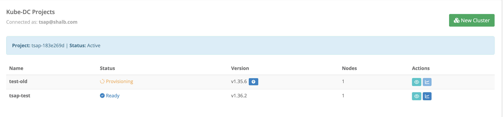

*The cluster list — each cluster with its phase (Ready / Provisioning), Kubernetes version, node count, and a one-click upgrade action when a newer version is available*

---

## 2. Cluster Provisioning & Lifecycle

### 2.1. Cluster creation

A cluster is created from the marketplace WebApp with a short guided form. The customer selects a name, a Kubernetes version from the supported catalogue, the cloud location, the initial worker pool shape (node count, CPU, memory, disk, image) and the network exposure mode. Optional toggles at creation time cover encryption-at-rest, scheduled etcd backups and a dedicated etcd datastore.

Everything the form collects maps onto a declarative cluster object; nothing is imperative. The same cluster can therefore be reproduced, version-controlled or created through automation, and the platform continuously reconciles the running cluster back towards the declared state.

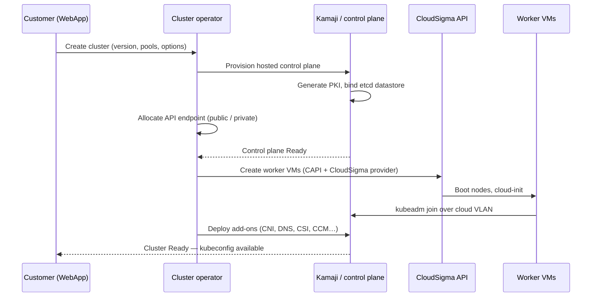

*Cluster Provisioning Flow*

### 2.2. Provisioning times

| Stage | Typical duration |
|---|---|
| Hosted control plane Ready | 1–3 minutes |
| First worker node joined and Ready | 2–15 minutes |
| Add-ons reconciled, cluster fully usable | +1–2 minutes after first node |
| Additional nodes in an existing pool | 2–15 minutes each, provisioned in parallel |

Control-plane readiness is fast because it is pod scheduling rather than VM provisioning. Worker-node time is dominated by CloudSigma VM boot and image preparation, and varies with image size and cloud location.

### 2.3. Kubernetes version support

The platform maintains a catalogue of supported Kubernetes minor versions, kept close to upstream. Customers select a version at creation and move between versions through the upgrade wizard (section 4). The version catalogue is surfaced in the WebApp so customers always see exactly what is available to create and to upgrade to.

### 2.4. Day-2 operations

All lifecycle operations are available after creation without recreating the cluster:

- **Add, resize or remove worker pools** — pools are independent objects; adding a pool never disturbs existing ones.
- **Scale a pool up or down**, including **scale to zero** to park a pool's cost without deleting its configuration.
- **Upgrade the control plane and each pool independently.**
- **Toggle the public API endpoint** on or off.
- **Enable or disable scheduled backups** and change schedule or retention.
- **Enable encryption-at-rest** and opt into scheduled key rotation.

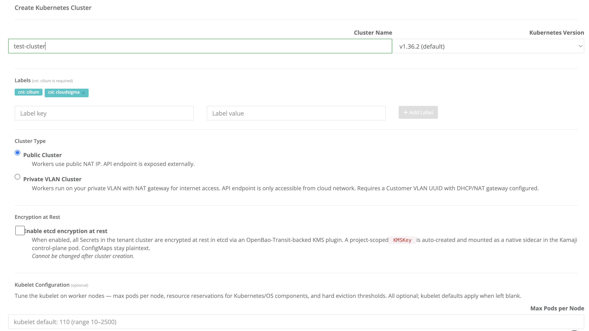

*Cluster creation — name and Kubernetes version, cluster labels, the Public vs. Private VLAN network choice, the etcd encryption-at-rest opt-in (immutable after creation), and optional kubelet tuning*

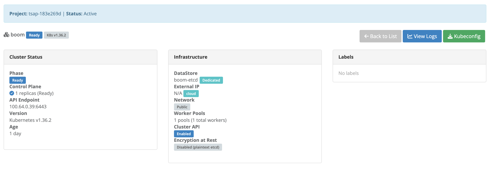

*A Ready cluster — control-plane replicas, API endpoint, version and age on the left; the infrastructure panel shows the dedicated etcd DataStore, network exposure, worker-pool rollup and encryption state, with kubeconfig download one click away*

---

## 3. Worker Pools & Compute

### 3.1. Pool model

A cluster contains one or more **worker pools**. Each pool is a homogeneous group of nodes with its own size, image, Kubernetes version, labels, taints and rollout policy. Pools are the unit of scaling, upgrading and scheduling segregation.

Because CloudSigma provisions CPU, RAM and storage independently rather than in fixed instance types, worker pools inherit that freedom directly. A pool is defined by the exact core count, memory and disk the workload needs, not by the nearest predefined instance size. This is the same "right-sizing" cost-control property that applies to CloudSigma VMs generally, applied to Kubernetes capacity.

- **Heterogeneous pools** — mix small general-purpose nodes with high-memory or high-core pools in one cluster, and target them with `nodeSelector` or affinity rules.
- **Multi-architecture** — `amd64` and `arm64` pools can coexist in the same cluster.
- **Labels and taints** — set per pool and applied at node registration, so scheduling constraints survive node replacement.
- **Per-pool Kubernetes version** — pools may deliberately lag the control plane within the supported skew window.
- **Scale to zero** — a pool can be scaled to zero nodes and back without losing its definition.

### 3.2. Kubelet configuration

Kubelet parameters that materially affect node stability are configurable per cluster and applied consistently across nodes:

- **`maxPods`** — the pod density ceiling per node, raised for large nodes running many small pods.
- **`kubeReserved` / `systemReserved`** — CPU, memory and ephemeral-storage carve-outs that protect the kubelet and OS from workload pressure.
- **`evictionHard`** — the thresholds at which the kubelet begins evicting pods, tuned to fire before the node's OOM killer does.

Correct reservation values are the single most effective defence against node-level instability on large nodes. The platform applies conservative defaults and supports per-cluster overrides where a workload profile justifies them.

### 3.3. Rollout safety controls

Any operation that replaces nodes — an upgrade, an image change, a pool reconfiguration — honours the pool's rollout policy:

| Control | Default | Purpose |
|---|---|---|
| `maxSurge` | 1 | Extra node provisioned before an old one is removed |
| `maxUnavailable` | 0 | No capacity reduction during rollout |
| `nodeDrainTimeoutSeconds` | Operator-set | Upper bound on graceful drain before forced removal |
| Pause | Off | Freeze a rollout mid-flight from the WebApp |
| PodDisruptionBudget | Customer-defined | Respected during every voluntary eviction |

The `maxSurge=1, maxUnavailable=0` default is the safest possible setting: capacity never dips below the declared pool size. It is also the slowest, which is the correct trade-off for production clusters.

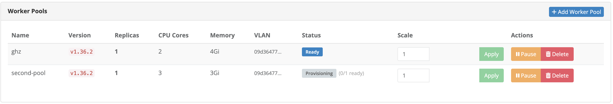

*Two pools with different shapes (2 cores/4 Gi and 3 cores/3 Gi) on the same cluster — per-pool version, VLAN, phase, and the Scale / Pause / Delete controls described in §3.3*

---

## 4. Cluster Upgrades

Upgrades are **staged**: the control plane and each worker pool move independently, under customer control, with a pause button at every step. This is the mechanism that makes upgrading a large production cluster a controlled sequence of small, reversible decisions rather than one irreversible event.

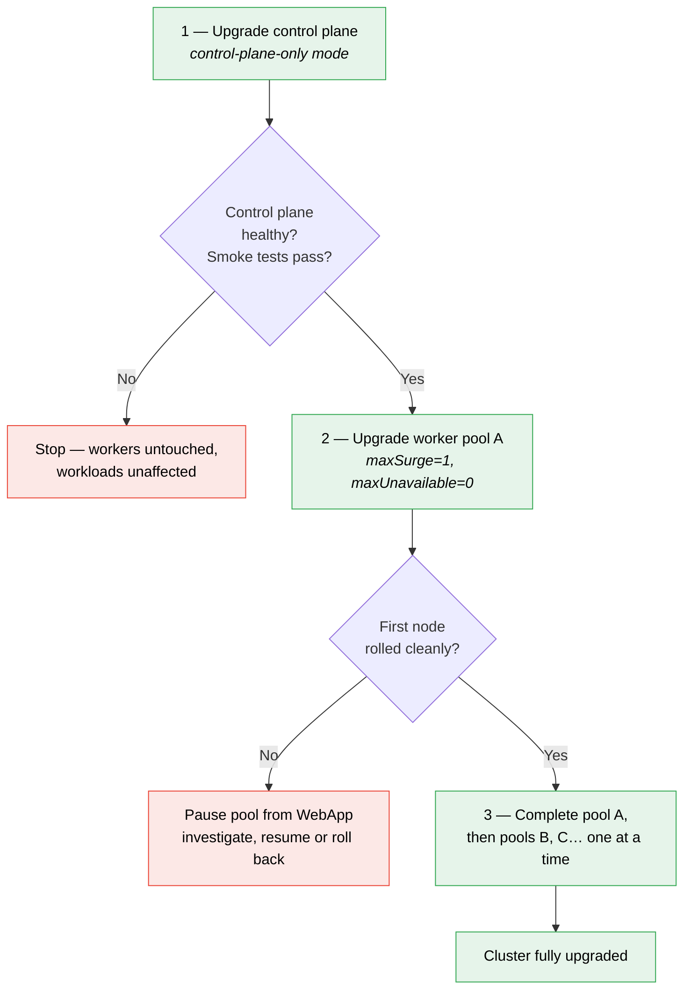

*Staged Upgrade Flow — control plane first, worker pools individually, pausable at any point*

### 4.1. Why the control plane goes first

Kubernetes permits worker kubelets to lag the control plane by up to two minor versions, but never to exceed it. Upgrading the control plane first is therefore the only valid ordering, and it has a useful property: **it does not touch customer workloads at all**. The control plane rolls as pods in the management cluster; no customer node is drained, no customer pod is evicted. Customers can validate the new control plane against their live workloads before committing to any node replacement.

### 4.2. Worker pool upgrades

Worker upgrades replace nodes rather than upgrading them in place. For each node, the platform provisions a replacement, waits for it to become Ready, cordons and drains the old node respecting PodDisruptionBudgets, then removes it. Pools upgrade one at a time and one node at a time by default.

**Capacity planning remains a customer responsibility.** The platform does not verify that the remaining nodes in a pool can absorb the workloads evicted from the node being replaced. For pools running large stateful pods, the customer must confirm that headroom exists before starting — a pod that cannot be rescheduled will block the drain.

### 4.3. Add-on lifecycle

Platform add-ons are upgraded out-of-band by CloudSigma on their own cadence, independent of the Kubernetes version bump. A cluster upgrade does not change add-on versions, and an add-on update does not require a cluster upgrade.

Full operational guidance, including recommendations for clusters with 20+ nodes and pods in the 50–100 GB range, is in [cluster-upgrades.md](cluster-upgrades.md).

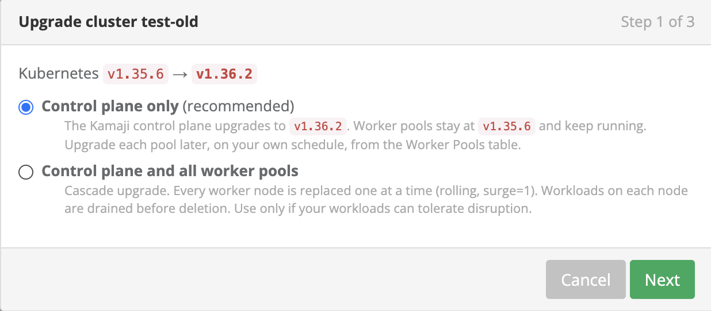

*The staged upgrade choice from §4 in the product: control-plane-only (recommended) leaves worker pools running on the previous version to upgrade later on your schedule; the cascade option documents its rolling, surge-1, drain-first behaviour up front*

---

## 5. Autoscaling

### 5.1. Control-plane vertical autoscaling — available

Every managed control plane is continuously right-sized by a **Vertical Pod Autoscaler (VPA)**. The recommender observes actual CPU and memory consumption of the API server, controller manager and scheduler, and produces target, lower-bound and upper-bound recommendations that are surfaced on the cluster's status.

This directly addresses the failure mode that statically sized control planes suffer under: an API server whose memory limit was set for a small cluster gets OOM-killed once the cluster's object count, CRD surface or list-watch traffic grows — taking `kubectl exec`, `kubectl logs`, the controller manager and the scheduler down with it.

Four modes are supported:

- **`Off`** — recommendation-only. Sizing signals are computed and reported, nothing is changed. Applied to every cluster as a baseline.
- **`Initial`** — recommendations are injected when a control-plane pod is created, never applied by eviction.
- **`Recreate`** — pods are evicted to apply new sizes. Effective but disruptive.
- **`InPlaceOrRecreate`** *(default)* — uses Kubernetes 1.33+ in-place pod resize where possible, falling back to eviction only when in-place resize is not applicable. **CPU resizing is restart-free.**

A per-cluster upper bound governs how large the recommender may go, so a single heavy tenant cannot exhaust management-cluster capacity through inflated resource requests. The bound is raised on request for clusters whose API server working set legitimately exceeds the default.

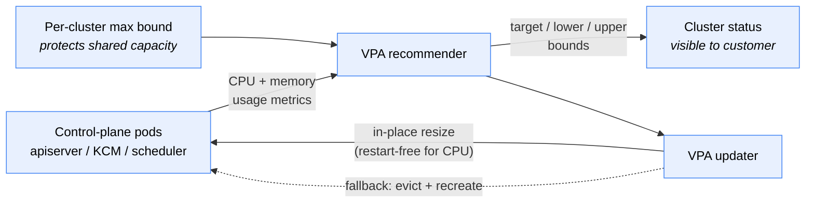

*Control-Plane Vertical Autoscaling Loop*

### 5.2. Worker pool autoscaling

Each worker pool can be switched from manual scaling to autoscaling directly on its row in the WebApp, and configured with a **minimum and maximum node count**. A pool runs in one of two modes, and the choice determines what signal drives it:

**Add nodes only.** The platform's own loop owns the node count and only ever grows the pool. It adds a node when pods are unschedulable for lack of capacity, and — optionally — when **measured CPU or memory usage** across the pool stays above a chosen percentage for a chosen period. This is the mode to pick when you want load-driven scaling: it reads live utilisation from the cluster's metrics pipeline. Nodes are never removed automatically.

**Add & remove nodes.** Upstream Cluster Autoscaler owns the node count, integrated with the CloudSigma provisioning API. It adds nodes when pods are unschedulable, and — opt-in — removes a node whose utilisation stays below a chosen percentage for a sustained period (50% over 10 minutes by default), draining it first and respecting PodDisruptionBudgets. It never goes below the pool minimum.

Two details worth knowing when choosing:

- **Only "Add nodes only" scales on usage.** Cluster Autoscaler adds capacity in response to pods that cannot be placed, not to a utilisation percentage — that is deliberate upstream design, not a platform limitation. A cluster whose pods request roughly what they use gets the same practical outcome from either mode.
- **Removal is measured on requests, not live load.** A node counts as idle when the CPU and memory *reserved by its pods* fall below the threshold. A node sitting at 5% CPU whose pods reserve 80% of its capacity is not idle and will not be removed — which is what you want, since those reservations are promises the scheduler has already made.

Thresholds and periods have sensible defaults and are tunable per pool. Pools with autoscaling enabled show *"Platform manages replicas"* — manual scale input is disabled while the platform owns the count, and autoscaling can be paused or disabled per pool at any time.

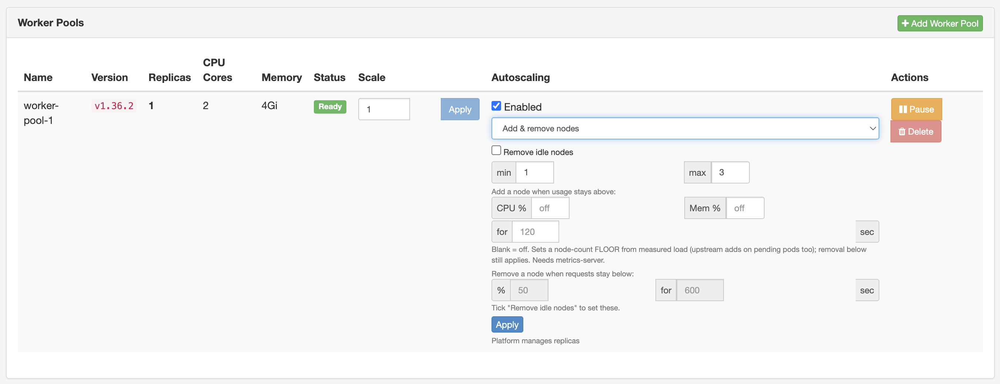

*Per-pool autoscaling in the WebApp: mode selection, min/max bounds, the usage thresholds that add nodes under "Add nodes only", and the opt-in idle-node removal with its own threshold and period under "Add & remove nodes"*

**Workload autoscaling inside the cluster** is independent of pool autoscaling: `HorizontalPodAutoscaler` and `VerticalPodAutoscaler` for customer workloads work exactly as upstream, driven by the same metrics pipeline. The two compose — HPA adds pods, and when those pods no longer fit, pool autoscaling adds nodes.

---

## 6. Storage

Persistent storage is delivered by the **CloudSigma CSI driver**, which provisions PersistentVolumes backed by the platform's clustered NVMe/SSD block storage — the same triple-replicated, RDMA-accelerated storage system described in section 8 of the parent *Platform Capabilities* document, with its IOPS profile and node-failure characteristics.

- **Default StorageClass** — `cloudsigma-dssd`. PVCs created without an explicit `storageClassName` bind to it automatically.
- **Custom StorageClasses** — customers may create their own with different parameters, filesystem types, mount options or a `Retain` reclaim policy. Customer-created StorageClasses are never modified or removed by the platform.
- **Dynamic provisioning** — volumes are created, attached and detached on demand as PVCs are created and pods are scheduled.
- **Standard semantics** — `ReadWriteOnce` block volumes with the usual Kubernetes attach/detach and resize behaviour.

Because the underlying storage replicates three copies across separate servers, a PersistentVolume survives drive, server and rack-level component failure without customer action and without data becoming even temporarily unavailable.

**Object storage** for workloads that need it (artifacts, backups, media) is available from the CloudSigma object storage service and consumed from a cluster with any S3-compatible client or operator.

**In practice** — a 5 Gi claim on a live cluster (`tsap-test`, zrh region), from claim to mounted filesystem. The default StorageClass binds on first consumer, the CSI driver provisions and attaches the DSSD volume, and the pod sees an ordinary block device:

```console
$ kubectl get storageclass
NAME                        PROVISIONER          RECLAIMPOLICY   VOLUMEBINDINGMODE      ALLOWVOLUMEEXPANSION   AGE
cloudsigma-dssd (default)   csi.cloudsigma.com   Delete          WaitForFirstConsumer   true                   26d

$ kubectl get pvc,pv
NAME                                STATUS   VOLUME                                     CAPACITY   ACCESS MODES   STORAGECLASS
persistentvolumeclaim/web-content   Bound    pvc-0559d867-e213-4c8a-99bb-686b8590b123   5Gi        RWO            cloudsigma-dssd

NAME                                                        CAPACITY   RECLAIM POLICY   STATUS   CLAIM                 STORAGECLASS
persistentvolume/pvc-0559d867-e213-4c8a-99bb-686b8590b123   5Gi        Delete           Bound    default/web-content   cloudsigma-dssd

$ kubectl exec deploy/web -- df -h /usr/share/nginx/html
Filesystem      Size  Used Avail Use% Mounted on
/dev/vdb        4.9G   24K  4.6G   1% /usr/share/nginx/html
```

---

## 7. Networking

### 7.1. Container networking — Cilium

Every cluster runs **Cilium** as its CNI, providing eBPF-based pod-to-pod networking and native enforcement of Kubernetes `NetworkPolicy` and `CiliumNetworkPolicy`. Customers author network policy as ordinary Kubernetes objects; the platform never modifies or removes customer policy.

### 7.2. Cluster addressing

Pod and Service CIDRs are configurable per cluster at creation, so a cluster's internal ranges can be chosen to avoid collision with the customer's existing VLAN and on-premises addressing.

### 7.3. Load balancing

Two complementary mechanisms serve `Service type=LoadBalancer`, selected by the cluster's network shape:

- **CloudSigma Cloud Controller Manager (CCM)** — for internet-facing services. On creating a `type=LoadBalancer` Service, the CCM selects a subscribed static IP from the customer's CloudSigma account, attaches it to a worker node through the CloudSigma API, opens the node firewall and configures routing so traffic reaching that IP lands on the Service. A plain, unannotated `type=LoadBalancer` Service is sufficient — no platform-specific annotation is required.
- **MetalLB** — for private-VLAN clusters. LoadBalancer VIPs are allocated from a pool on the customer's own VLAN and advertised at layer 2, making the Service reachable from other VMs on that VLAN without traversing the public internet.

The CCM also performs the standard cloud-provider node lifecycle duties: labelling nodes with their region and instance topology, and removing Node objects for VMs that no longer exist.

### 7.4. In-cluster API access

A **kube-api-proxy** component runs in every cluster so that `kubernetes.default.svc` resolves and works normally from inside pods. This makes in-cluster controllers, operators, service meshes and admission webhooks function exactly as they would on a self-hosted cluster, despite the API server living outside the cluster's own network. It is transparent and requires no customer configuration.

### 7.5. Cluster add-ons summary

| Add-on | Role | Customer interface |
|---|---|---|
| Cilium | CNI, network policy | `NetworkPolicy`, `CiliumNetworkPolicy` |
| CoreDNS | Cluster DNS | Standard service discovery |
| kube-api-proxy | In-cluster API reachability | Transparent |
| CloudSigma CSI | Block storage | `PersistentVolumeClaim`, `StorageClass` |
| CloudSigma CCM | LoadBalancer + node lifecycle | `Service type=LoadBalancer` |
| MetalLB | LoadBalancer on private VLAN | `Service type=LoadBalancer` |
| konnectivity-agent | `exec` / `logs` / `port-forward` tunnel | Transparent |
| Metrics pipeline | Resource metrics | `kubectl top`, HPA/VPA |

Add-ons are continuously reconciled against a tested baseline, which keeps every cluster identical and predictable. Full per-add-on detail — what is configurable, what is reverted, and the common operations for each — is in [cluster-addons.md](cluster-addons.md).

**In practice** — the two LoadBalancer models on live clusters in the zrh region. On a **public cluster**, a plain unannotated `type=LoadBalancer` Service gets a CloudSigma static IP attached, tagged and routed by the CCM within seconds:

```console
$ kubectl get svc web
NAME   TYPE           CLUSTER-IP       EXTERNAL-IP    PORT(S)        AGE
web    LoadBalancer   10.102.192.168   178.22.67.48   80:31328/TCP   17s
```

```text
# CloudSigma CCM (control-plane log)
Discovered 1 static IPs and 11 dynamic IPs
Tagged IP 178.22.67.48 with cluster=test-old, service=default/web
```

On a **private-link cluster**, worker nodes have no public NIC at all; the CCM detects this and defers LoadBalancer VIPs to MetalLB on the customer's own VLAN:

```text
# CloudSigma CCM (control-plane log)
Server 9efc3888-… has no public NIC — treating as private-link / VLAN-only worker;
skipping CCM LoadBalancer IP management for this node (MetalLB manages LB IPs on customer VLAN)
```

The private backplane is visible from inside any cluster — worker nodes live on the cloud VLAN, and `kubernetes.default` resolves through the transparent kube-api-proxy:

```console
$ kubectl get nodes -o wide
NAME                                   STATUS   ROLES    AGE   VERSION   INTERNAL-IP     EXTERNAL-IP
9efc3888-1c01-4a7c-9d2c-4a21b8fb7fb0   Ready    <none>   23d   v1.36.2   100.64.128.16   <none>

$ kubectl get svc -n kube-system kube-api-proxy
NAME             TYPE        CLUSTER-IP       EXTERNAL-IP   PORT(S)    AGE
kube-api-proxy   ClusterIP   10.107.108.151   <none>        6443/TCP   26d
```

---

## 8. API Endpoints — Public, Private and Break-Glass

Cluster API reachability is an explicit, changeable property of the cluster rather than a decision frozen at creation.

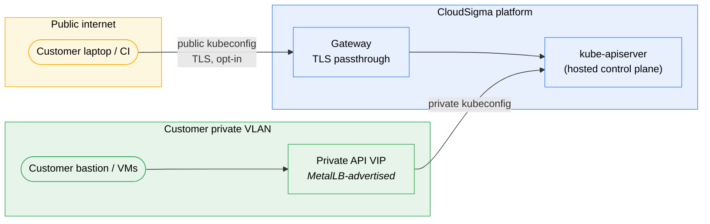

*API Endpoint Topology — public and private paths to the same control plane*

### 8.1. Public endpoint

The cluster's API server is published through a TLS-passthrough gateway on a platform hostname. TLS terminates at the customer's own API server, not at the gateway — the platform forwards the encrypted stream without the ability to inspect it. The public endpoint is a **toggle**: it can be enabled for initial setup and disabled once private access is established, or left on permanently for teams operating from anywhere.

### 8.2. Private endpoint

For clusters attached to a customer VLAN, the API server is additionally reachable on a VIP advertised on that VLAN. Traffic from the customer's own VMs and bastion hosts reaches the control plane without traversing the public internet at all. Customers who require it can run with the public endpoint switched **off** entirely, leaving the private VIP as the only path.

### 8.3. Break-glass access

Running with a private-only endpoint introduces a dependency: if the customer's VLAN or bastion becomes unavailable, they lose the ability to reach their own cluster to diagnose the problem. The platform therefore offers an **opt-in break-glass public route** — the same TLS-passthrough gateway path, enabled on demand, with a separate downloadable kubeconfig. The private VIP remains the primary path and is unchanged; break-glass is purely additive and can be switched off again once normal access is restored.

### 8.4. Credentials

Cluster access is delivered as a standard `kubeconfig`, downloadable from the WebApp in admin and private-endpoint variants. Inside the cluster, authorization is ordinary Kubernetes RBAC — customers create their own Roles, ClusterRoles and bindings, integrate with their own identity provider if desired, and the platform does not interpose on cluster-internal authorization decisions.

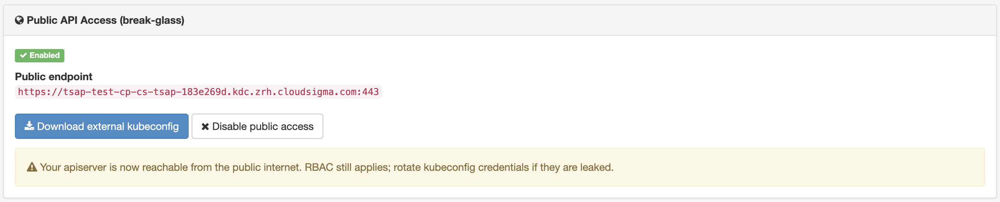

*The break-glass panel on a private-link cluster: the public endpoint hostname, a one-click external kubeconfig download, the disable switch — and the reminder that RBAC still applies on the public path*

---

## 9. Security

Security in the managed Kubernetes service is layered: encryption of cluster state at rest, strict multi-tenant isolation of key material, controlled and audited operator access, and the customer's own in-cluster controls.

### 9.1. Encryption at rest

Customers can enable **etcd encryption-at-rest** per cluster with a single toggle. Once enabled, every Secret — and optionally other resource types — is sealed before it is written to disk, using a three-layer key hierarchy:

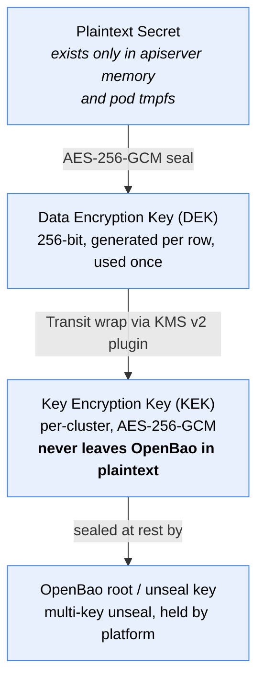

*Encryption-at-Rest Key Hierarchy*

The control plane runs a **KMS v2 plugin** sidecar alongside the API server. The API server asks the sidecar to wrap or unwrap data encryption keys; the sidecar forwards to OpenBao Transit, which performs the cryptography internally. **The key encryption key never leaves OpenBao in plaintext**, and the sidecar authenticates using a projected Kubernetes ServiceAccount token validated by OpenBao — no static credentials exist on disk.

The guarantee this delivers: anyone obtaining a bit-for-bit copy of the etcd database file or a backup archive, without also holding OpenBao access, sees ciphertext only.

### 9.2. Key isolation between tenants

Key material is isolated at three levels: an OpenBao **namespace per organization** — a kernel-level barrier where cross-namespace reads return not-found — a **mount per project** inside that namespace, and a **Transit key per cluster** inside that mount. Key isolation is enforced by the key store itself, not by application-level filtering.

### 9.3. Key rotation

Customers can opt into **scheduled key-encryption-key rotation** on a chosen interval. Rotation generates a new key version; subsequent writes use it while earlier versions remain available for decryption until re-wrapping completes. Rotation state — current version, last rotation, next scheduled rotation, minimum decryption version — is reported on the cluster status so customers can evidence their rotation posture for audit.

The complete threat model, including an explicit table of what encryption-at-rest does and does not protect against, is in [encryption-at-rest-design.md](encryption-at-rest-design.md).

### 9.4. Operator access controls

Customers requiring assurance about CloudSigma-side access have a documented, auditable model:

- **A single bastion host** is the only network entry to the management platform; control-plane nodes have no public IPs and SSH is public-key-only.
- **A GitOps repository is the only configuration-change path.** No operator runs ad-hoc changes against the platform; every change is a reviewed commit with signed history.
- **Secrets in that repository are encrypted at rest** with a committed, auditable list of authorized decryption keys.
- **Two access tiers:** day-to-day access via SSO with a per-engineer identity recorded in every audit entry, and a break-glass path that is rotated after every use, with the rotation itself recorded as a commit.

Full detail is in [operator-access-controls.md](operator-access-controls.md).

### 9.5. Customer-side controls

Inside the cluster, the customer holds the standard Kubernetes security surface unmodified: RBAC, ServiceAccounts, `NetworkPolicy` and `CiliumNetworkPolicy`, Pod Security Standards, admission webhooks, and any third-party policy engine or scanner they choose to install.

### 9.6. Vulnerability response

Platform components, node images and add-ons are patched on a managed cadence. Security issues that require coordinated action are documented with customer-facing analysis, exposure assessment and mitigation guidance — see [cve-2026-43284-dirty-frag-mitigation.md](cve-2026-43284-dirty-frag-mitigation.md) for a worked example of the process.

---

## 10. Backup & Recovery

### 10.1. Control-plane state

Each cluster's etcd can be snapshotted on a **configurable schedule** to object storage, with **configurable retention**. Backups protect against catastrophic loss of the control plane's persistent state — the scenario that would otherwise mean total cluster loss.

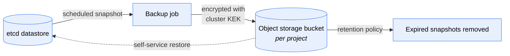

*etcd Backup Pipeline*

- **Schedule and retention** are customer-configurable per cluster.
- **Backups inherit encryption.** For clusters with encryption-at-rest enabled, the snapshot is wrapped by the same customer-scoped key — a stolen backup archive is ciphertext. Encrypted snapshots are labelled as such in the snapshot picker.
- **Backup status is reported on the cluster**, including the timestamp and identifier of the most recent successful snapshot, so a failing backup is visible rather than silent.
- **On-demand snapshots.** *Take snapshot now* runs a one-off job with the same configuration as the daily backup, with the cluster staying online.
- **Self-service restore.** The customer picks any retained snapshot in the WebApp and restores the control plane to it. The tenant API is unreachable for roughly 60–120 seconds during the restore; workload pods on worker nodes keep running throughout. Control-plane state created after the snapshot is lost — the WebApp states this before the action is confirmed.
- **Deleting a cluster retains its snapshots** in the backup bucket, so an accidental deletion is not a data-loss event for control-plane state.

### 10.2. Workload state

Control-plane snapshots cover Kubernetes object state, not the contents of PersistentVolumes. Customers running stateful workloads should additionally use a workload-level backup tool — Velero and application-native backup operators both run normally on the platform — or the block-storage backup capability described in section 8.2 of the parent *Platform Capabilities* document.

### 10.3. High availability

The control plane runs with multiple replicas and automatic failover; etcd runs highly available and can be **dedicated per cluster** for customers who require physical separation of their control-plane state from other tenants, or **shared** for cost efficiency. Worker-node failure is handled by ordinary Kubernetes rescheduling, and pool rollouts respect PodDisruptionBudgets so availability constraints declared by the customer are honoured during every platform-initiated node replacement.

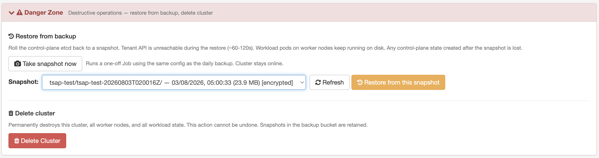

*Self-service recovery: the snapshot picker (showing an encrypted daily snapshot with size and timestamp), on-demand snapshot, and restore — with the impact stated in the UI before anything runs*

---

## 11. Monitoring & Observability

Each cluster exposes the standard Kubernetes observability surface, and the platform monitors the components it operates.

- **Resource metrics** are available in-cluster, powering `kubectl top`, HorizontalPodAutoscaler and VerticalPodAutoscaler for customer workloads.
- **Cluster and pool status** — phase, ready/updated/deleting replica counts, per-pool observed version, control-plane readiness, backup and encryption state — is reported continuously and visible in the WebApp.
- **Kubernetes events** for every lifecycle operation (provisioning, scaling, upgrades, failures) are surfaced in the WebApp and available through `kubectl` for the customer's own tooling.
- **Control-plane logs** for the customer's own cluster — kube-apiserver, etcd, the KMS plugin and the cloud controller manager — are browsable in Grafana with per-component filtering, error counts and full log lines, even though those components run outside the cluster in the hosted control plane.
- **Customer-owned observability stacks** — Prometheus, Grafana, Loki, OpenTelemetry collectors, or any commercial agent — install and run normally. The platform imposes no restriction on what a customer deploys to observe their own cluster.
- **Platform-side monitoring** — CloudSigma monitors control-plane health, etcd, backups and add-on reconciliation across every managed cluster, and acts on alerts without waiting for a customer report.

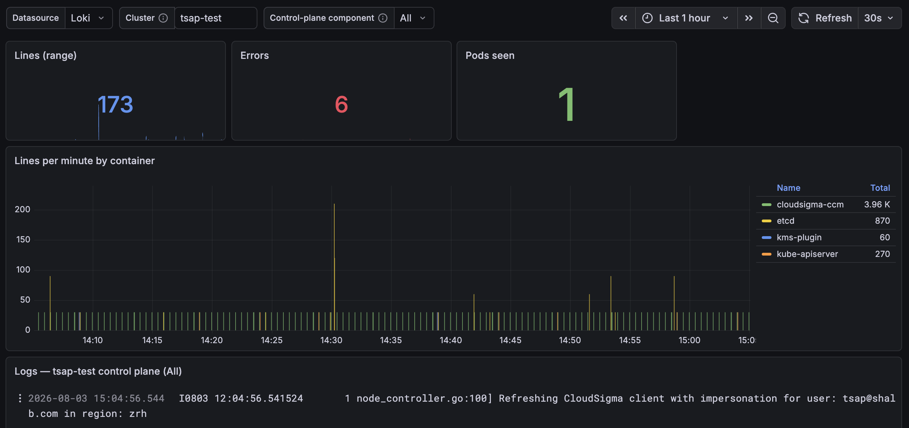

*The hosted control plane is not a black box: per-cluster log dashboards break down lines and errors by component — kube-apiserver, etcd, kms-plugin, cloudsigma-ccm — with the raw log stream below*

---

## 12. Interoperability & Portability

The service is deliberately built to avoid lock-in, consistent with CloudSigma's platform-wide position:

- **Upstream Kubernetes, unmodified.** No forked API server, no proprietary resource types a workload must adopt.
- **Standard tooling** — `kubectl`, Helm, Kustomize, Argo CD, Flux, Terraform and CI systems all work without platform-specific plugins.
- **Portable manifests.** Workload definitions carry no CloudSigma-specific fields. The only platform-aware objects are the StorageClass name and `type=LoadBalancer` Services, both of which are standard Kubernetes constructs with equivalents on any other provider.
- **Open-source add-ons** — Cilium, CoreDNS, MetalLB, Kamaji, Cluster API, OpenBao — all replaceable knowledge, all publicly documented.
- **Full API coverage.** Every operation available in the WebApp is available declaratively, so cluster fleets can be managed as code.

---

## 13. Service Support & SLA

Managed Kubernetes is covered by the CloudSigma support channels and service levels described in sections 15 and 16 of the parent *Platform Capabilities* document: 24/7 live support via chat, email, phone and ticketing, with a response-time guarantee of under one hour across all channels and typically immediate response on live chat.

Support scope specific to this service:

| Area | Handled by |
|---|---|
| Control-plane availability, performance and upgrades | CloudSigma |
| etcd health, backups and restores | CloudSigma |
| Platform add-on faults and updates | CloudSigma |
| Worker node provisioning failures | CloudSigma |
| Encryption key material and rotation | CloudSigma |
| Customer workload faults, scheduling and configuration | Customer, with CloudSigma advisory support |
| Cluster capacity planning | Customer, with CloudSigma advisory support |

Configuration changes that are not yet exposed as a WebApp control — non-default rollout strategies, drain timeouts, kubelet reservation overrides, raised autoscaling bounds — are applied by CloudSigma on request through a support ticket.

---

## 14. Roadmap

The following capabilities are in active development. Items are listed because they affect architectural planning; availability dates are confirmed through the account team.

- **Customer-supplied object storage for backups** — targeting a customer-owned external bucket.
- **Expanded WebApp coverage** for controls currently applied by support request: rollout strategy, drain timeout, kubelet reservations.
- **Additional infrastructure providers** for hybrid and multi-cloud worker pools.

---

## Related documentation

| Document | Covers |
|---|---|
| [cluster-addons.md](cluster-addons.md) | Per-add-on reference — what is configurable, what is reconciled, common operations |
| [cluster-upgrades.md](cluster-upgrades.md) | Upgrade best practices for production and large clusters |
| [encryption-at-rest-design.md](encryption-at-rest-design.md) | Full key hierarchy, threat model and isolation design |
| [operator-access-controls.md](operator-access-controls.md) | How CloudSigma operators access the platform, and how it is audited |
| [cve-2026-43284-dirty-frag-mitigation.md](cve-2026-43284-dirty-frag-mitigation.md) | Worked example of the vulnerability-response process |

---

## Screenshot index

Screenshots live in `docs/img/`, captured from the CloudSigma marketplace WebApp.

| File | Screen | Status |
|---|---|---|
| `mk8s-01-cluster-list.png` | Cluster list | ✅ Captured |
| `mk8s-02-create-wizard.png` | Create Cluster | ✅ Captured |
| `mk8s-03-cluster-summary.png` | Summary tab | ✅ Captured |
| `mk8s-04-worker-pools.png` | Workers tab | ✅ Captured |
| `mk8s-05-upgrade-wizard.png` | Upgrade wizard | ✅ Captured |
| `mk8s-06-autoscaling-status.png` | Worker pool autoscaling controls | ✅ Captured |
| `mk8s-09-endpoints-kubeconfig.png` | Break-glass public API panel | ✅ Captured |
| `mk8s-10-backup-config.png` | Snapshot picker + self-service restore | ✅ Captured |
| `mk8s-logging-grafana.png` | Control-plane log dashboard (Grafana) | ✅ Captured |
| ~~`mk8s-07-storage.png`~~ | Storage | Replaced by live `kubectl` console examples (§6) |
| ~~`mk8s-08-network-tab.png`~~ | Networking | No such WebApp tab exists — replaced by live in-cluster console examples (§7.5) |
| ~~`mk8s-11-events-tab.png`~~ | Events tab | Superseded by the Grafana control-plane log dashboard |
